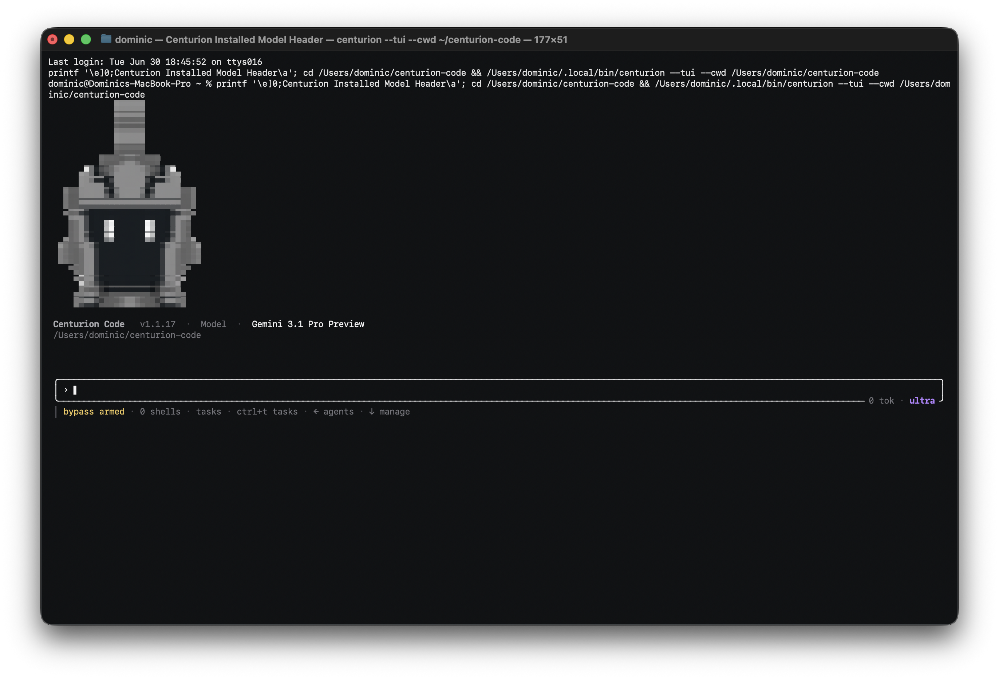

<div align="center">

# Centurion Code

**A terminal-first agent harness for serious engineering work.**

Centurion Code owns the operator loop, session history, provider selection, advisor/council flows, native tools, and verifier gate. OpenAI/Codex, Anthropic/Claude, Google Gemini/Antigravity, and xAI/Grok run behind it as interchangeable engines over OAuth or API keys.



</div>

---

## Install

Centurion ships as standalone binaries. End users do not need this source checkout, Node, pnpm, or Bun to run the release build.

### One-Line Installers

macOS and Linux:

```sh
curl -fsSL https://raw.githubusercontent.com/Thecenturion-co/Centurion-Code/main/install.sh | sh
```

Windows PowerShell:

```powershell
irm https://raw.githubusercontent.com/Thecenturion-co/Centurion-Code/main/install.ps1 | iex
```

The installer creates both `centurion` and `cen`.

### Direct Downloads

| Platform            | Asset                         |
| ------------------- | ----------------------------- |
| macOS Apple Silicon | `centurion-darwin-arm64`      |
| macOS Intel         | `centurion-darwin-x64`        |
| Windows x64         | `centurion-windows-x64.exe`   |
| Windows ARM64       | `centurion-windows-arm64.exe` |
| Linux x64           | `centurion-linux-x64`         |
| Linux ARM64         | `centurion-linux-arm64`       |

Download from the [latest GitHub release](https://github.com/Thecenturion-co/Centurion-Code/releases/latest).

### npm Wrapper

For Node-based environments:

```sh
npm install -g @thecenturion/code
```

The npm package is a thin launcher that downloads the native binary for the current platform. It does not publish Centurion source.

## Quick Start

```sh
centurion doctor
centurion providers
centurion
```

Inside the TUI:

```text
/providers          inspect provider login/API-key state
/model              choose the model for the active provider
/advisor            choose a separate advisor model
/effort             set low, medium, high, or ultra reasoning effort
/goal fix the failing tests
/swarm refactor the parser and prove the tests
/stop               interrupt the active turn
```

## Providers

Centurion can run with any connected provider. At least one provider must be available:

| Provider           | OAuth path                                                      | API-key path                         |
| ------------------ | --------------------------------------------------------------- | ------------------------------------ |
| OpenAI / Codex     | `centurion connect codex` or existing `codex` login             | `OPENAI_API_KEY` or `CODEX_API_KEY`  |
| Anthropic / Claude | `centurion connect claude` or existing Claude Code login        | `ANTHROPIC_API_KEY`                  |
| Google / Gemini    | `centurion connect gemini` or existing Gemini/Antigravity login | `GEMINI_API_KEY` or `GOOGLE_API_KEY` |
| xAI / Grok         | `centurion connect grok` or existing Grok CLI login             | `XAI_API_KEY` or `GROK_API_KEY`      |

Provider secrets are consolidated only with user action:

```sh
centurion env-sync
centurion env-sync apply
```

OAuth token files are detected as login evidence, but Centurion does not copy OAuth token files into `~/.centurion/providers/centurion.env`. API-key values are copied only when visible in supported provider env files or process env, and secret values are never printed.

## What Centurion Owns

Centurion is not a thin prompt wrapper. The product boundary stays at Centurion:

- **Operator relationship**: Centurion owns the chat, session transcript, prompt bar, persona, and command surface.
- **Provider runtime**: Codex, Claude, Gemini/Antigravity, and Grok run headless as backing engines.
- **Native tools**: file reads/writes/edits, grep, command execution, GitHub/GitLab repo/review/issue/pipeline/code-search tools.
- **Goal loop**: think, act, observe, verify, and retry are Centurion states, not provider states.
- **Verifier gate**: a goal is not done until Centurion-owned checks prove it.
- **Advisor/council/swarms**: secondary models can review, advise, or race without switching the main provider.
- **Local memory**: session summaries and operator context live under the user’s local Centurion directory.

```text
operator
   |
   v
Centurion TUI / commands / session memory
   |
   +-- native tools: files, shell, GitHub, GitLab, verifier
   +-- advisor: optional second model
   +-- council: read-only cross-model review
   +-- provider engine: Codex | Claude | Gemini | Grok
          |
          v
       model turn
```

## Updates

Binary installs update through a signed release manifest:

```sh
centurion update --check
centurion update
```

Every release includes:

- platform binaries,
- `manifest.json`,
- `manifest.json.sig`,
- `checksums.txt`.

Centurion verifies the signed manifest, validates the artifact hash, and atomically replaces only the running binary.

## Source And License

Centurion Code is proprietary software distributed as compiled binaries. This repository is the public front door for installers, release metadata, and documentation. The production source is not published here.

See [EULA.md](./EULA.md), [SECURITY.md](./SECURITY.md), and [THIRD_PARTY_NOTICES.md](./THIRD_PARTY_NOTICES.md).

© The Centurion LLC. All rights reserved.
