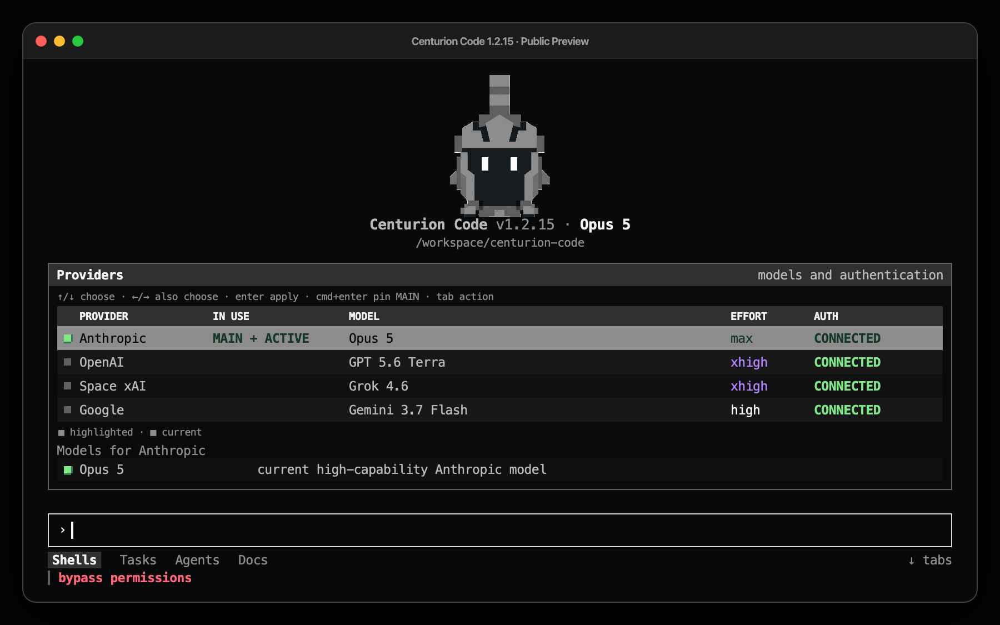

<div align="center">

# Centurion Code

**The coding agent that has to prove it finished.**

Every other agent stops when the model stops asking for tools. Centurion stops when your tests pass.



[Install](#install) · [How it works](./docs/HOW-IT-WORKS.md) · [Configuration](./docs/CONFIGURATION.md) · [Commands](#commands) · [Providers](#providers)

</div>

---

## The idea

Point Centurion at a goal. It drives the AI CLI you already pay for, then runs your real checks as
real subprocesses: `typecheck`, `lint`, `test`, whatever your project actually uses.

If a check fails, Centurion reads the failure, classifies it, and sends the engine back in with the
evidence. It keeps a per-attempt ledger, so it knows whether the last turn made things better or just
moved them around. It says DONE only when every required check exits `0`.

```
THINK ──▶ ACT ──▶ OBSERVE ──▶ VERIFY ──▶ DONE
   ▲                             │        (every required check exited 0)
   └── REPAIR / RESUME_ENGINE ◀──┘
                                 └──────▶ ESCALATE / GIVE_UP  (budget spent)
```

The engine cannot fake this. The command behind each check is snapshotted before the engine gets its
first turn, so a model that rewrites `"test": "echo ok"` mid-run fails with a tampering error instead
of a green tick.

## Install

Centurion ships as a signed, standalone binary. You do not need Node, pnpm, or Bun to run it.

**macOS and Linux**

```sh
curl -fsSL https://raw.githubusercontent.com/Thecenturion-co/Centurion-Code/main/install.sh | sh
```

**Windows PowerShell**

```powershell
irm https://raw.githubusercontent.com/Thecenturion-co/Centurion-Code/main/install.ps1 | iex
```

Both installers give you `centurion` and the short alias `cen`.

**Direct download**

| Platform            | Asset                         |
| ------------------- | ----------------------------- |
| macOS Apple Silicon | `centurion-darwin-arm64`      |
| macOS Intel         | `centurion-darwin-x64`        |
| Linux x64           | `centurion-linux-x64`         |
| Linux ARM64         | `centurion-linux-arm64`       |
| Windows x64         | `centurion-windows-x64.exe`   |
| Windows ARM64       | `centurion-windows-arm64.exe` |

From the [latest release](https://github.com/Thecenturion-co/Centurion-Code/releases/latest). macOS
binaries are signed with a Developer ID and notarized by Apple.

## First run

```sh
centurion doctor      # what is installed, logged in, and reachable
centurion providers   # which engines you can actually use
centurion             # start the TUI
```

Then give it something to prove:

```sh
centurion goal "fix the failing tests"
```

## How it works

Centurion is not a prompt wrapper. It owns the operator loop and treats the vendor CLI as a
replaceable engine underneath it.

```
operator
   │
   ▼
Centurion  ── session transcript, memory, command surface
   │
   ├── native tools ......... files, grep, shell, GitHub, GitLab
   ├── verifier ............. your real checks, as real processes
   ├── advisor .............. an optional second model reviewing the first
   ├── council .............. read-only cross-model review
   └── engine ............... Codex │ Claude │ Gemini │ Grok
                                 │
                                 ▼
                              model turn
```

What that buys you, concretely:

- **A goal that ends in proof**, not in "the model seemed satisfied".
- **Evidence you can read.** Every attempt appends to a ledger: what changed, which checks ran, what
  failed, and whether it counted as progress. A crashed run resumes from that ledger instead of
  starting over.
- **More than one model on one problem.** `/swarm` races engines in separate git worktrees.
  `/consult` gets a second opinion without switching your main engine.
- **Isolation when you want it.** Run a goal inside a git worktree so a bad turn cannot touch your
  working tree.
- **Your existing subscriptions.** It rides the vendor CLIs you are already logged into over OAuth,
  so there is no second bill.

## Commands

Inside the TUI, `/help` lists everything. The ones worth knowing first:

```text
/goal <prompt>        run to proven completion
/swarm <task>         race several engines on the same task
/verify               run the checks right now
/status               loop state, active goal, verifier status
/diff [--stat]        what changed
/consult              ask other models about the current state
/review               have the engine review its own diff
/model, /effort       choose the model and how hard it thinks
/compact              summarize a long session to reclaim context
/rewind               restore a code and conversation checkpoint
/worktree             enter or leave an isolated worktree
/stop                 halt the running turn
```

From your shell: `centurion goal`, `doctor`, `providers`, `connect`, `sessions`, `transcript`,
`schedule`, `env-sync`, `update`.

## Providers

At least one engine must be available. Centurion detects logins you already have.

| Provider           | OAuth                                                       | API key                              |
| ------------------ | ----------------------------------------------------------- | ------------------------------------ |
| OpenAI / Codex     | `centurion connect codex` or an existing `codex` login      | `OPENAI_API_KEY` or `CODEX_API_KEY`  |
| Anthropic / Claude | `centurion connect claude` or an existing Claude Code login | `ANTHROPIC_API_KEY`                  |
| Google / Gemini    | `centurion connect gemini` or an existing Gemini login      | `GEMINI_API_KEY` or `GOOGLE_API_KEY` |
| xAI / Grok         | `centurion connect grok` or an existing Grok CLI login      | `XAI_API_KEY` or `GROK_API_KEY`      |

Centurion never copies OAuth token files. It reads them only as evidence that you are logged in.
API-key values are imported only when you ask, with `centurion env-sync apply`, and secret values are
never printed.

## Updates and integrity

```sh
cen update --check
cen update
```

Every release carries `manifest.json`, an Ed25519 `manifest.json.sig`, and `checksums.txt`. Before
replacing anything, Centurion verifies that signature against a public key compiled into the binary,
checks the artifact hash and size, refuses a downgrade, and swaps the file atomically. A release host
that got compromised still could not push you a forgery.

## Documentation

- [How it works](./docs/HOW-IT-WORKS.md): the loop, the failure signature, the ledger, isolation, and
  how updates are signed.
- [Configuration](./docs/CONFIGURATION.md): every setting, where state is stored, and how to pin the
  checks a goal is judged against.

## Source and license

Centurion Code is proprietary software distributed as compiled binaries. This repository is the
public front door: installers, release metadata, and documentation. The production source is not
published here.

[EULA](./EULA.md) · [Security policy](./SECURITY.md) · [Third-party notices](./THIRD_PARTY_NOTICES.md)

© The Centurion LLC. All rights reserved.
